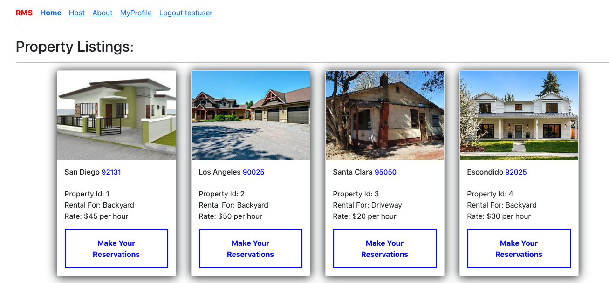

# RentMySpace
## Description
Have you gone to a beach on weekends and struggled to get a parking spot or 
had trouble in finding a place to park near big events like the 4th of July firework ? 
Or do you wish to host a swimming pool party but are restriced because you 
don't have swimming pool in your house? 

‘Rent My Space’ app can provide solutions to these problems. This app provides a 
listing of all the properties for renters to book. The renters can book the 
property for using the driveway, backyard swimming pool or other spaces.

## Users 
There are 2 types of users for this app 1) property owners and 2) renters
The property owners will provide information about their property that they 
plan to rent through a form input. The property will then be listed on the app. 
The renter can book the property based on the availability. The renter can  make 
payments to the owner for using the property. 

## Data Source and API
The data for this app will be generated by the users of the app( the owners and
renters). The CRUD operations can be performed through the end points of the REST API. An external google API is accessed to get the maps of the property.

## Live Server
The site is deployed on Heroku and can be found here 

## Tech Stack
* The front end React app (client)
* The backend Express (Node.js) server.
* Database: PostgreSQL 

## Features
* Property Listings
* User sign in, authentication
* File uploads from client to server
* Booking calendar
* Restricted page access

## User Flow
* User signs into account with user details
* User logs in using username and passowrd
* For hosting property add properties through 'Host' link
* Property will be listed in the listings page.
* To Book a property click 'Make Reservations' from listings page.
* My profile displays a list of properties and bookings for the user.

## How to run the application in your local machine
* Download from the git hub link ( or fork)
* To create db and schemas in terminal run script psql<rental.sql
* To start the server: 1) cd backend 2) npm install 3) npm start
* To start the client: 2) cd frontend 2) npm install 3) npm start

## How to run the tests
* The testing of the application is done using jest
* Create test db refer to config.js
* psql < rental_test.sql
* To run individual tests:  npm test auth.test.js 
* npm test
* Use postman to test the api

## API end points
https://docs.google.com/document/d/1cGZTy8YXECu6Yb2IhojzNHBygbxbdH0AART1Q4dRtrs/edit?usp=sharing

## DB Schema
https://docs.google.com/document/d/1TpySxFjMZNoi6P3eLA5IZusexQ5Ruj0LUNHSJKAKKUc/edit

## Stretch Goals
* Use Venmo/paypal api for payments
* Implement various search filters
* Use cloud server to store image instead of heroku

